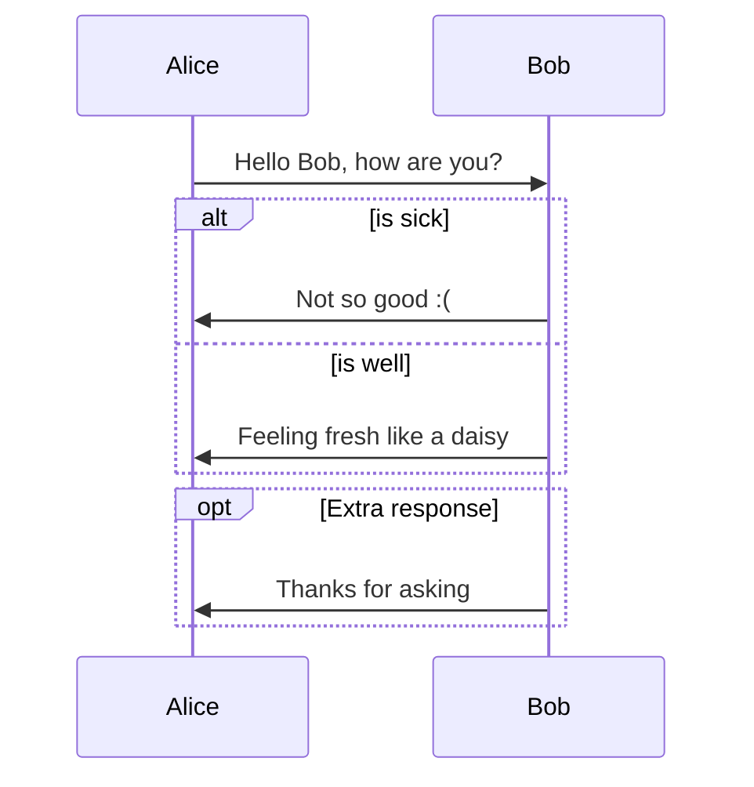
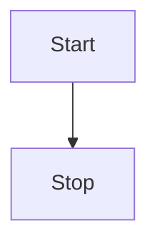
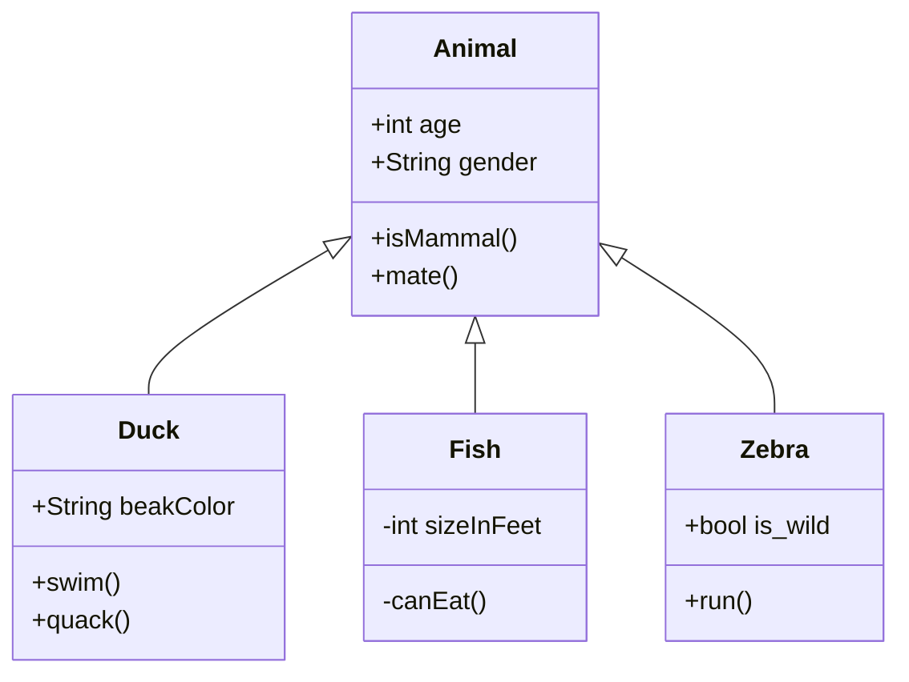
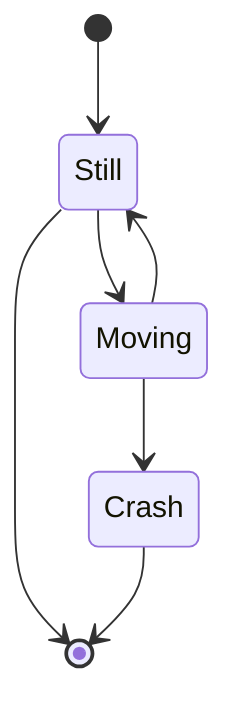
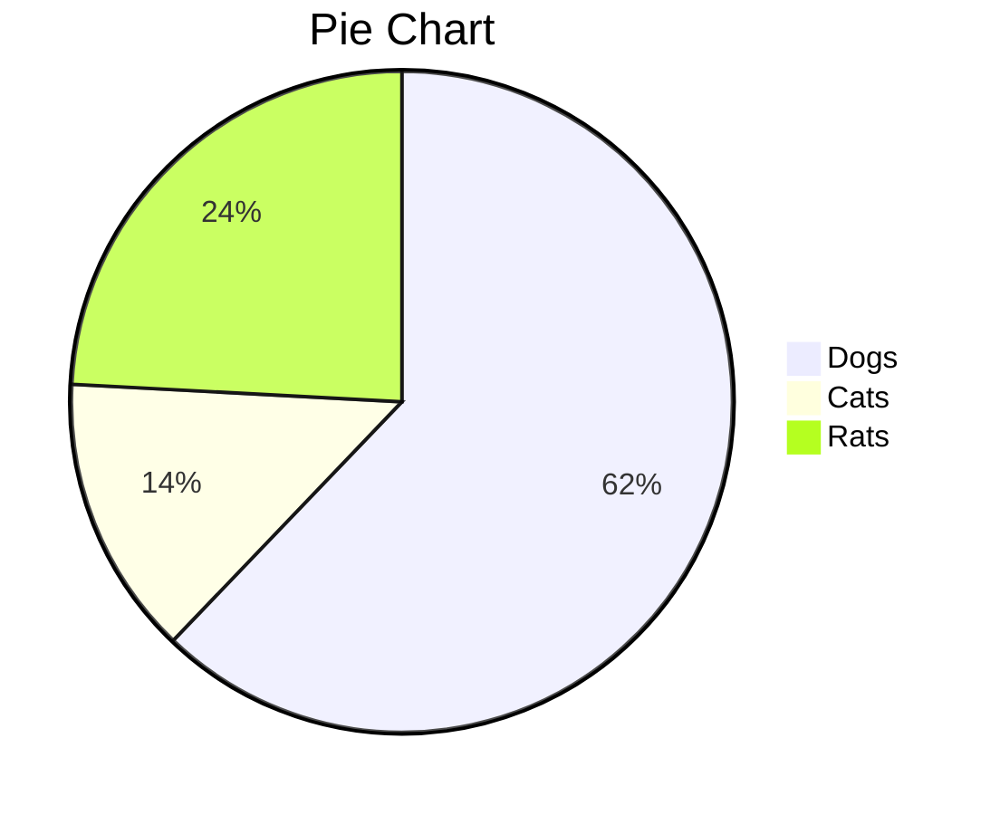
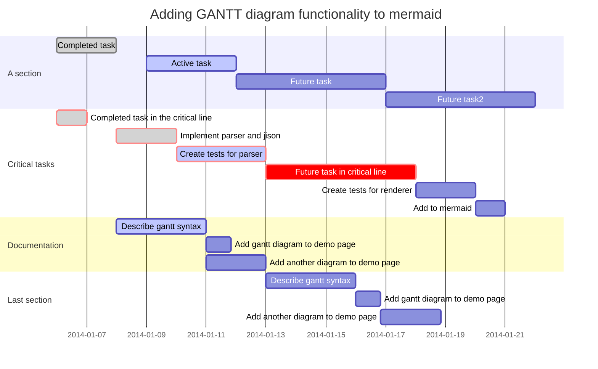
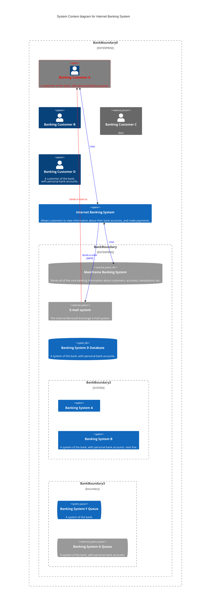
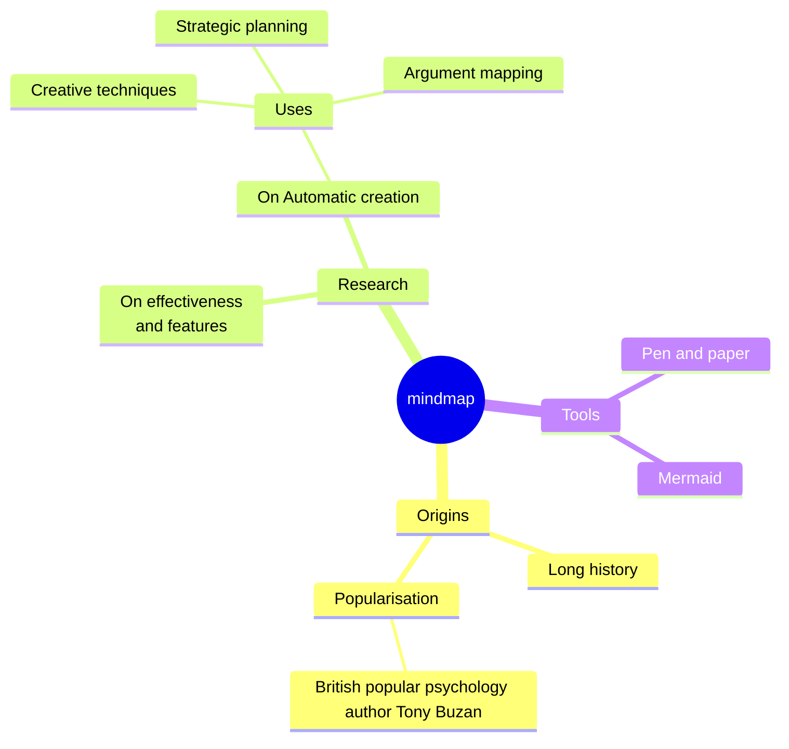

***
#### Daftar Isi

[Pengertian Markdown](#apa-itu-markdown?)
1. [Headings](#headings)
2. [Paragraph](#paragraph)
3. [Line Breaks](#line-breaks)
4. [Horizontal Rules](#horizontal-rules)
5. [Text Styling](#text-styling)
    - [Bold](#bold) 
    - [Italic](#italic)
    - [Bold & Italic](#bold-and-italic)
    - [Marked Text](#marked-text)
    - [Strikethrough Text](#strikethrough-text)
    - [Subscript](#subscript)
    - [Superscript](#superscript)
    - [Underlined Text](#underline)
6. [Blockquote](#blockquote)
    - [Blockquote with Paragraph](#blockquote-with-paragraph)
    - [Nested Blockquote](#nested-blockquote)
7. [Code](#code)
    - [Inline Code](#inline-code)
    - [Code Block](#code-block)
    - [Syntax Highlighting](#syntax-highlighting)
8. [List](#list)
    - [Ordered List](#ordered-list)
    - [Unordered List](#unordered-list)
    - [Task List](#task-list)
9. [Links](#links)
    - [Inline Links](#inline-links)
    - [Internal Links](#internal-links)
    - [Add Title](#add-title-links)
    - [Direct Links](#direct-links)
    - [Formatting Links](#formatting-links)
    - [Reference Style Links](#reference-style-links)
    - [Linking to Heading IDs](#linking-to-heading-id)
    - [Link Target](#link-targets)
10. [Images](#images)
    - [Embed image or file](#embed-image-or-file)
    - [Add title](#add-title-image)
    - [Linking Image](#linking-image)
    - [Sized Image](#sized-image)
    - [Image Captions](#image-captions)
11. [Tables](#tables)
    - [Alignment](#alignment)
    - [Formatting Text in Tables](#formatting-text-in-tables)
    - [Table with list](#table-with-list)
12. [Footnotes](#footnotes)
13. [Defenition List](#defenition-list)
14. [Abbrevations](#abbrevations)
15. [Emoji](#emoji)
16. [Diagrams](#diagrams)
    - [Squance Diagrams](#squance-diagrams)
    - [Flowcharts](#flowcharts)
    - [Class Diagrams](#class-diagrams)
    - [State Diagrams](#state-diagrams)
    - [Pie Charts](#pie-charts)
17. [Latex with Katex](#latex-with-katex)
18. [Tips & Trik](#tips-and-trik)
    - [Admonitions](#admonitions)
    - [Color](#color)
    - [Comments](#comments)
    - [Escaping Characters](#escaping-character)
    - [Indentasi](#indentasi)
    - [Symbols](#symbols)
    - [Table Of Contents](#table-of-content)
    - [Text Alignment](#text-alignment)
    - [Video](#video)
***

***
## Apa itu Markdown?
***
**Markdown** adalah bahasa markup sederhana yang ringan menggunakan sintaks pemformatan teks biasa, dengan tujuan untuk dikonversi menjadi format HTML terstruktur.

Dibuat oleh **John Gruber** pada tahun 2004 mengunakan bahasa perl dirancang untuk mempermudah menulis dan membaca dokumen berbasis web. 

> Tujuan Desain utama untuk sintaks pemformatan Markdown adalah membuatnya semudah mungkin dibaca. Idenya adalah bahwa dokumen berformat Markdown harus dapat diterbitkan apa adanya, sebagai teks biasa, tanpa terlihat seperti telah ditandai dengan tag atau instruksi pemformatan.

1. ### Headings
```
# Header 1
## Header 2
### Header 3
#### Header 4
##### Header 5
###### Header 6

HEADER 1
========

HEADER 2
--------

- Heading IDs
## Heading 2 {#custom-id}
			or
<h2 id="custom-id">Heading 2</h2>
```

2. ### Paragraph  
Untuk membuat paragraf gunakan baris kosong untuk memisahkan satu atau beberapa baris teks.  
Jika ingin membuat paragraf di dalam list tambahkan 1 tab / ident. Cth:
```
Saya ingin belajar Markdown

Saya ingn belajar Programming
```

3. ### Line Breaks
Untuk membuat baris baru gunakan tag `<br>` atau gunakan 2 atau lebih spasi diakhir baris lalu tekan enter.

4. ### Horizontal Rules 
( `***`)  
(`---`)  
( `___`) 

6. ### Text Styling
- ##### Bold  
`**Ini teks bold**`  
`__Ini juga teks bold__`
- ##### Italic  
`*Ini teks italic*`  
`_Ini juga teks italic_`
- ##### Bold and Italic  
`***Ini teks bold italic***`  
`___Ini juga teks bold italic___`  
`__*Ini juga teks bold italic*__`  
`**_Ini juga teks bold italic_**`
- ##### Marked text  
`==Teks yg ditandai==`  
- ##### Strikethrough text  
`~~Teks yg dicoret~~`  
- ##### Subscript  
`H~2~O` or `H<sub>2</sub>O`  = H<sub>2</sub>O  
- ##### Superscript  
`X^2^` or `X<sup>2</sup>` = X<sup>2</sup>
- ##### Underline  
`Text will be <ins>Underlined</ins>`

6. ### Blockquote
`> Menulis blockquote`  
- ##### Blockquote with paragraph
```
> Blockquote pertama.
> 
> Blockquote kedua
```
- ##### Nested Blockquote
```
> Blockquote pertama
>> Blockquote nested
```
7. ### Code
- ##### Inline Code
```
`ping google.com`
```
- ##### Code Block
````
```
git init
git add
git commit
```
````
- ##### Syntax Highlighting
````
```c
#include <stdio.h>

int main(){
	printf("Hello World!");
	return 0;
}
```
````

> 📝**Note:** Untuk menampilkan triple backticks gunakan quadruple backticks. (\````)

8. ### List
- ##### Ordered List  
Untuk membuat list berurut, tambahkan item baris dengan angka diikuti titik. Nomor tidak harus dalam urutan numerik, tetapi harus dimulai dari angka satu. Cth:
```
1. Mobile Legends
2. PUBG
3. Genshin Impact
		or
1. Mobile Legends
5. PUBG
9. Genshin Impact

Akan menghasilkan daftar urutan yang sama.
```
- ##### Unordered List  
Untuk membuat daftar tidak berurutan, tambahkan dashes (`-`), asterisk (`*`) atau plus sign (`+`) didepan item baris. Identasi satu tab untuk membuat nested list.  Cth:
```
- Item satu
- Item dua
- Item tiga
	+ Nested list satu
	+ Nested list dua
- Item empat
- 1969.\
```

- ##### Task List
```
- [ ] Incomplete list
- [x] Complete list
```

9. ### Links
> 📝**Note:** Jika di alamat URL or nama file ada spasi gunakan %20 untuk menggabungkan spasi tersebut.
- ##### Inline links  
`[Github](https://github.com)`
- ##### Internal links  
`[Markdown](Ebook%20Markdown.md)`
- ##### Add title links
`[Github](https://github.com "Share & collaborate")`
- ##### Direct links  
`https://github.com`  
`<https://github.com>`  
`<fake@mail.com>`  
- ##### Formatting links
```
I love supporting the **[EFF](https://eff.org)**

This is the *[Markdown Guide](https://www.markdownguide.org)*

See section [`code`](#code)
```

- ##### Reference-style links  
	- First Part of the Links  
		- `[Github Pages][2]`  
		- `[Reddit Pages][3]`  
	- Second Part of the Links  
		- `[2]: https://en.wikipedia.org/wiki/Hobbit#Lifestyle`
		- `[2]: https://en.wikipedia.org/wiki/Hobbit#Lifestyle "Hobbit lifestyles"`
		- `[3]: https://en.wikipedia.org/wiki/Hobbit#Lifestyle 'Hobbit lifestyles'`
		- `[3]: https://en.wikipedia.org/wiki/Hobbit#Lifestyle (Hobbit lifestyles)`
		- `[3]: <https://en.wikipedia.org/wiki/Hobbit#Lifestyle> "Hobbit lifestyles"`
		- `[3]: <https://en.wikipedia.org/wiki/Hobbit#Lifestyle> 'Hobbit lifestyles'`
		- `[3]: <https://en.wikipedia.org/wiki/Hobbit#Lifestyle> (Hobbit lifestyles)`
- ##### Linking to Heading ID
```
## Belajar Markdown

[Judul Besar](#belajar-markdown)
```
- ##### Link targets  
`<a href="https://www.markdownguide.org" target="_blank">Learn Markdown!</a>`

10. ### Images
- ##### Embed image or file  
``  
`![[RootExplorer.apk]]`  

- ##### Add title image 
``  

- ##### Linking image  
`[](https://i0.wp.com/dianisa.com/wp-content/uploads/2022/08/1.-Gambar-Anime-HD-Keren.jpg)`

- ##### Sized image  
``  
or   
``
- ##### Image captions
```
<figure>
    
    <figcaption>A single track trail outside of Albuquerque, New Mexico.</figcaption>
</figure>
```

11. ### Tables
[Markdown Tables Generator](https://www.tablesgenerator.com/markdown_tables)
```
| No | Username | Password |
|----|----------|----------|
| 1. | root     | root     |
| 2. | kali     | kali     |
```

- ##### Alignment  
```
|Left| Middle    | Right     | 
|:---|:---------:|----------:| 
| 1. | admin     | admin123  |
| 2. | root      | root123   |
```

- ##### Formatting Text in Tables  

```
| Syntax      | Description |
| ----------- | ----------- |
| Header      | Title |
| Paragraph   | First paragraph. <br><br> Second paragraph. |
```

- ##### Table with list
```
| Syntax      | Description |
| ----------- | ----------- |
| Header      | Title |
| List        | Here's a list! <ul><li>Item one.</li><li>Item two.</li></ul> |
```

12. ### Footnotes
 
```
Here's a simple footnote,[^1] and here's a longer one.[^bignote]

[^1]: This is the first footnote.

[^bignote]: Here's one with multiple paragraphs and code.

    Indent paragraphs to include them in the footnote.

    `{ my code }`

    Add as many paragraphs as you like.
```
13. ### Defenition List
```
First Term
: This is the definition of the first term.

Second Term
: This is one definition of the second term.
: This is another definition of the second term.
```

14. ### Abbrevations
```
*[HTML]: Hyper Text Markup Language         

The HTML specification is maintained by the W3C.
```

15. ### Emoji
- Emoji copy paste  
[Emojipedia](https://emojipedia.org/)  
- Emoji shortcodes  
[List of emoji shortcodes ](https://gist.github.com/rxaviers/7360908)

16. ### Diagrams
Untuk belajar lebih lanjut kunjungi situs [Diagram Mermaids JS](https://mermaid.js.org/syntax)
- ##### Squance Diagrams

````


````

- ##### Flowcharts
Here is a simple flow chart:

`````

`````

- ##### Class Diagrams

`````


`````

- ##### State Diagrams

`````


`````

- ##### Pie Charts

`````


`````

- ##### Gantt Charts
````

````


- ##### C4 Diagrams



- ##### Mindmap
````gfm

````

- ##### Gitgraph Diagrams
````

````

- ##### Requirement Diagrams
````gfm
```mermaid
requirementDiagram requirement test_req { id: 1 text: the test text. risk: high verifymethod: test } element test_entity { type: simulation } test_entity - satisfies -> test_req 
```
````

17. ### Latex with Katex
The *Gamma function* satisfying $\Gamma(n) = (n-1)!\quad\forall n\in\mathbb N$ is via the Euler integral

$$
\Gamma(z) = \int_0^\infty t^{z-1}e^{-t}dt\,.
$$


18. ### Tips and trik
- ###### Admonitions
Untuk membuat peringatan gunakan *Blockquote, emoji dan emphasis.*
```
> :warning: **Warning:** Do not push the big red button.

> :memo: **Note:** Sunrises are beautiful.

> :bulb: **Tip:** Remember to appreciate the little 
```

- ###### Color
`<p style="color:lime">text color</p>` 

- ###### Comments
```
[This is a commentarry]: #
[Ini akan disembnyikan]: # Ini juga disembunyikan
```

- ###### Escaping Character
**Characters You Can Escape**

You can use a backslash to escape the following characters.

|Character|Name|
|---|---|
|`\`|backslash|
|`|backtick (see also [escaping backticks in code](https://www.markdownguide.org/basic-syntax/#escaping-backticks))|
|*|asterisk|
|_|underscore|
|{ }|curly braces|
|[ ]|brackets|
|< >|angle brackets|
|( )|parentheses|
|#|pound sign|
|+|plus sign|
|-|minus sign (hyphen)|
|.|dot|
|!|exclamation mark|
|\||pipe (see also [escaping pipe in tables](https://www.markdownguide.org/extended-syntax/#escaping-pipe-characters-in-tables))|
- ###### Indentasi
`&nbsp;&nbsp;&nbsp;&nbsp;This is the first sentence of my indented paragraph.`
- ###### Symbols
Berikut sebagian daftar entitas HTML untuk simbol:

- Hak Cipta (©) —`&copy;`
- Merek dagang terdaftar (®) —`&reg;`
- Merek Dagang (™) —`&trade;`
- Euro (€) —`&euro;`
- Panah kiri (←) —`&larr;`
- Panah atas (↑) —`&uarr;`
- Panah kanan (→) —`&rarr;`
- Down arrow (↓) — `&darr;`
- Gelar (°) —`&#176;`
- Pi (π) —`&#960;`

Untuk daftar lengkap entitas HTML yang tersedia, lihat halaman Wikipedia tentang [Entitas HTML](https://https://en.wikipedia.org/wiki/List_of_XML_and_HTML_character_entity_references)
- ###### Table Of Content
```
#### Table of Contents

- [Underline](#underline)
- [Indent](#indent)
- [Center](#center)
- [Color](#color)
```

- ###### Text alignment
```
<p align="center">Text di tengah</p>
<p align="justify">Text rata kanan kiri</p>`  
<p align="right">Text rata kanan</p>
```

- ###### Video
```
[](https://www.youtube.com/watch?v=PYCxct2e0zI)
```

